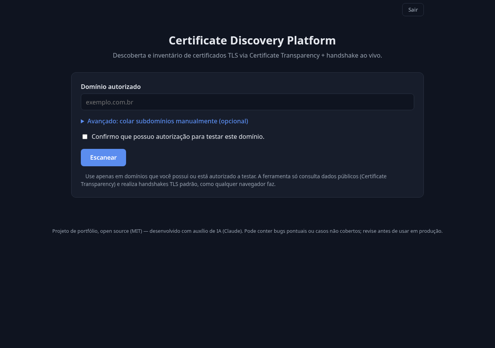
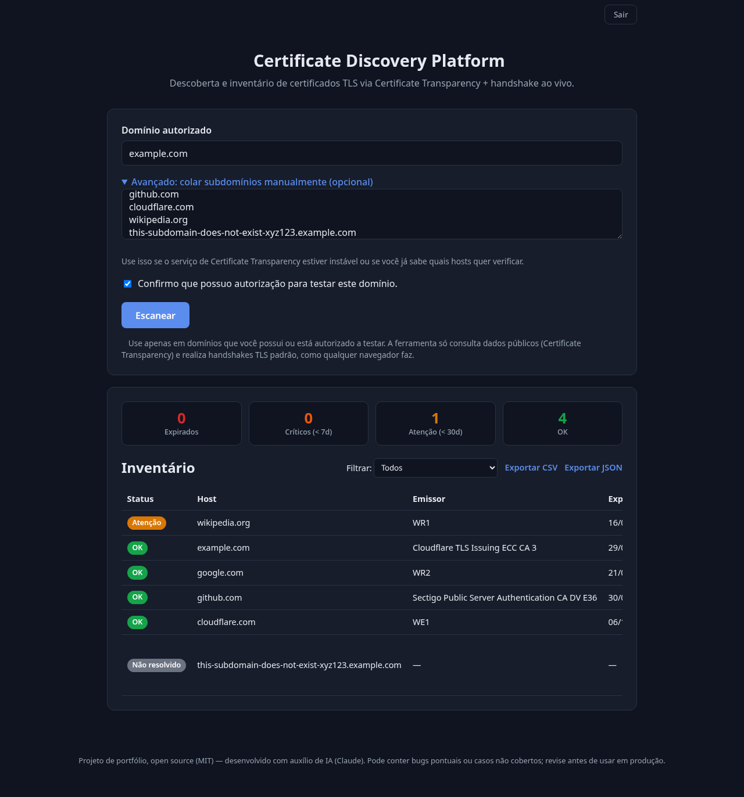
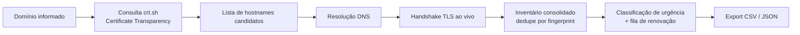
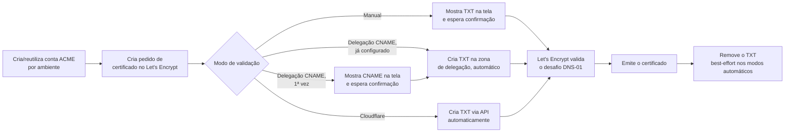

# Certificate Manager


[](https://github.com/FJK-20/cert-discovery/pkgs/container/cert-discovery)

Plataforma open source de gerenciamento de certificados TLS, ciclo de vida
completo: descoberta, emissão/renovação via ACME (Let's Encrypt e ZeroSSL)
ou CSR manual, renovação agendada com notificação, multiusuário com SSO, e
log de auditoria tamper-evident.

A descoberta consulta fontes públicas de Certificate Transparency,
identifica hosts relacionados, realiza resolução DNS e handshake TLS ao
vivo e consolida tudo num inventário — mas é só a primeira etapa do ciclo;
dali em diante a aplicação também emite, renova e audita.

> **Nota:** este projeto foi desenvolvido com auxílio de IA (Claude), como
> peça de portfólio pessoal. O código foi revisado, mas pode conter bugs
> pontuais, casos de borda não cobertos ou comportamento inesperado em
> ambientes fora dos testados aqui. Use por sua conta e risco, revise antes
> de qualquer uso além de estudo/demonstração, e sinta-se à vontade para
> abrir uma issue se encontrar algo estranho.

<p align="center">
  
  
</p>

## Problema

Organizações frequentemente possuem certificados distribuídos entre
servidores, aplicações e provedores diferentes. Isso aumenta o risco de
certificados expirarem sem acompanhamento.

## Solução

A plataforma cobre o ciclo de vida inteiro do certificado, não só a
descoberta:

- **descoberta**: Certificate Transparency logs + handshake TLS ao vivo,
  deduplicação por fingerprint SHA-256, classificação por urgência de
  expiração, dashboard visual (cards clicáveis, gráficos por emissor/prazo,
  painel de detalhes com SANs/serial/fingerprint), export CSV/JSON;
- **emissão/renovação**: ACME real (Let's Encrypt e ZeroSSL) com DNS-01
  manual, Cloudflare, Azure DNS ou delegação CNAME — ou CSR manual pra CA
  que não fala ACME;
- **automação**: renovação agendada com retry/backoff, fila com estado
  visível, notificação por webhook/e-mail quando falha ou exige ação manual;
- **multiusuário**: 4 papéis com segregação de funções, login local ou SSO
  via SAML 2.0 (Entra ID/Azure AD ou qualquer IdP padrão), API keys pra
  acesso programático;
- **segurança e compliance**: log de auditoria tamper-evident (cadeia de
  hashes), criptografia em repouso, cabeçalhos de segurança HTTP estritos.

## Como funciona



Importante: o crt.sh só devolve **metadados** (emissor, validade, SANs), não
os bytes do certificado. Por isso o inventário distingue dois tipos de
achado:

- **Confirmado ao vivo** (`live`): o handshake TLS teve sucesso, o
  certificado real foi capturado e tem fingerprint SHA-256 verificável — só
  esses entram nas classificações `expired`/`critical`/`warning`/`ok` e na
  fila de renovação.
- **Só CT log** (`ct_only`/`wildcard`/`unresolved`): hostname histórico sem
  confirmação ao vivo (por exemplo, um wildcard `*.sub.dominio.com`, ou um
  host que não resolveu DNS, ou que recusou o handshake). Aparece no
  inventário para visibilidade, mas não é tratado como certeza.

## ⚠️ Uso responsável

Use apenas em domínios que você possui ou está explicitamente autorizado a
testar. A ferramenta só consulta dados públicos (Certificate Transparency) e
realiza handshakes TLS padrão — o mesmo que qualquer navegador faz ao abrir
um site — mas ainda assim é um scanner, e como tal deve ser usado com
autorização e bom senso. O formulário exige uma confirmação explícita de
autorização antes de iniciar um scan.

## Instalação e execução

### Opção 1 — Docker (recomendada, mais simples)

Pré-requisito: [Docker](https://docs.docker.com/get-docker/) com Docker Compose.

```bash
git clone https://github.com/FJK-20/cert-discovery.git
cd cert-discovery
docker compose up --build
```

Abra `http://localhost:8000` no navegador. Pronto — nenhuma instalação de
Python, pip ou dependências no seu sistema. No primeiro acesso, a aplicação
pede para cadastrar o admin (veja [Acesso e autenticação](#acesso-e-autenticação)).

### Opção 2 — Python direto (sem Docker)

Pré-requisito: Python 3.13+ (para captura completa da cadeia de
certificados — em 3.12 ou anterior, a aplicação roda normalmente mas captura
só o certificado-folha, sem a cadeia).

```bash
git clone https://github.com/FJK-20/cert-discovery.git
cd cert-discovery
python3 -m venv .venv
source .venv/bin/activate   # Windows: .venv\Scripts\activate
pip install -r requirements.txt
uvicorn app.main:app --host 0.0.0.0 --port 8000 --workers 1
```

Abra `http://localhost:8000`.

### Opção 3 — imagem publicada (sem clonar o repositório)

Toda vez que `master` recebe um push, uma imagem é publicada automaticamente
no GitHub Container Registry:

```bash
docker run -p 8000:8000 -v cert-discovery-data:/app/data ghcr.io/fjk-20/cert-discovery:latest
```

O volume nomeado (`cert-discovery-data`) é o que persiste usuários,
certificados e histórico entre execuções — sem ele, tudo se perde quando o
container para.

## Deploy com um clique

Duas plataformas com camada gratuita, ambas detectam o `Dockerfile`
automaticamente:

[](https://railway.app/new/github/FJK-20/cert-discovery)
&nbsp;
[](https://render.com/deploy?repo=https://github.com/FJK-20/cert-discovery)

Depois do primeiro deploy, defina `CERTDISC_COOKIE_SECURE=true` (a
plataforma termina TLS na borda) e configure um volume/disco persistente
apontando pra `/app/data` — sem isso, cada novo deploy reseta usuários e
certificados.

> **Nota sobre persistência**: disco persistente é um recurso pago em
> algumas plataformas (o plano gratuito do Render, por exemplo, não inclui
> disco — os dados não sobrevivem a um redeploy nesse plano). Pra uma demo
> rápida isso não importa; pra um uso real, use um plano com disco ou rode
> via Docker Compose num servidor próprio (ver Opção 1 acima).

## Acesso e autenticação

A aplicação exige uma conta autenticada (usuário + senha) e suporta
múltiplos usuários (ver [Usuários, papéis e auditoria](#usuários-papéis-e-auditoria)).
A autenticação em dois fatores (**MFA/TOTP**) é **opcional**, desligada por
padrão — cada usuário ativa a própria quando quiser, já logado, na seção
"🔒 Segurança".

1. **Primeiro acesso**: ninguém cadastrado ainda → tela de cadastro
   (usuário + senha, mínimo 8 caracteres), que sempre cria o primeiro
   **admin**. Ao concluir, já entra autenticado — sem etapa extra forçada.
   Depois disso, novas contas só são criadas por um admin já logado, não
   por autocadastro aberto.
2. **Ativar o MFA (opcional)**: em "🔒 Segurança", um QR code é exibido para
   escanear com um app autenticador (Google Authenticator, Authy, 1Password,
   etc. — qualquer app compatível com TOTP/RFC 6238). O MFA só passa a
   `ativado` depois de confirmar um código válido de 6 dígitos gerado pelo
   app — isso garante que o autenticador está configurado corretamente antes
   de depender dele num login futuro. Também é possível desativar a
   qualquer momento (confirmando a senha atual).
3. **Acessos seguintes**: login com usuário/senha; se o MFA estiver
   ativado, uma segunda etapa pede o código do autenticador. A sessão fica
   em um cookie `httpOnly`.
4. Toda a API exige sessão autenticada — sem login válido, retorna 401; sem
   o papel certo (rota de escrita, papel `leitor`), retorna 403.

As contas (usuário, papel, hash da senha, segredo TOTP quando o MFA está
ativo) ficam em `data/admin.json` (permissão `0600`), persistidas via
volume Docker entre reinícios.

**Perdeu a senha do único admin (ou o acesso ao MFA dele)?** Pare o
serviço, apague `data/admin.json` e refaça o cadastro. Não há fluxo de
recuperação de conta por e-mail — trade-off deliberado de um MVP de
portfólio, não um recurso faltando por descuido. Se você tem mais de um
admin cadastrado, qualquer um dos outros pode remover a conta travada e
criar uma nova.

## Emissão via ACME (DNS-01)

Além do inventário, a aplicação emite/renova certificados **reais** via
duas CAs que falam ACME v2 — [Let's Encrypt](https://letsencrypt.org/) e
[ZeroSSL](https://zerossl.com/) — usando desafio **DNS-01**, a mesma prova
de posse de domínio que qualquer CA usa, mas sem depender de expor a porta
80 do host (diferente do desafio HTTP-01). ZeroSSL exige credenciais de
External Account Binding (EAB — kid + hmac key, obtidas no painel da
ZeroSSL em Developer → EAB Credentials), configuradas uma vez em
Configurações antes do primeiro uso; não tem ambiente de staging separado
— todo certificado emitido por ela sai real.

Quatro jeitos de resolver o desafio, escolhidos na tela de Emissão:

- **Manual (padrão)** — a aplicação calcula o registro TXT
  (`_acme-challenge.<domínio>`) e mostra o nome/valor pra você criar em
  **qualquer** provedor de DNS, sem credencial nenhuma. Um botão "Verificar
  propagação e continuar" confirma via consulta DNS real antes de avisar a
  CA — evita gastar uma tentativa de validação (rate limit da CA) num
  registro que ainda não propagou. Repete a cada emissão/renovação.
- **Delegação CNAME (configuração única)** — meio-termo entre o manual e o
  automático. Na primeira vez pra um domínio, você configura **uma vez** um
  `CNAME _acme-challenge.<domínio> → <hash>.acme-delegate.<sua zona>`
  apontando pra uma zona que você controla via API. Dali em diante, toda
  emissão/renovação futura *daquele domínio* detecta o CNAME já existente e
  segue 100% automática — sem token nenhum do lado do domínio emitido, e
  sem repetir o passo manual. É a mesma técnica que os principais plugins
  DNS do Certbot documentam pra provedores sem API própria.
- **Automático via Cloudflare (opcional)** — um
  [API Token](https://dash.cloudflare.com/profile/api-tokens) (não a Global
  API Key) com permissão **Zone → DNS → Edit** cria e remove o TXT sozinho,
  direto na zona do domínio emitido.
- **Automático via Azure DNS (opcional)** — um service principal do Entra
  ID com o papel **DNS Zone Contributor** escopado só à zona (não à
  subscription inteira) faz a mesma coisa via API REST do Azure Resource
  Manager. Cliente HTTP puro (`httpx`), sem depender do SDK oficial do
  Azure — mantém a filosofia de dependência mínima do projeto.

O token da Cloudflare/credencial do Azure (usados pelos dois últimos modos)
são validados antes de salvar e criptografados em repouso, nunca
reexibidos. Cloudflare e Azure são dois de vários provedores possíveis — a
interface interna (`set_dns_challenge`/`clear_dns_challenge` em
`app/acme/issuance.py`) já é genérica o bastante pra outro provedor plugar
sem mudar o fluxo ACME em si.

### Como usar

1. Informe o domínio, escolha o ambiente e o modo de validação.
2. **Staging** (padrão): certificado de teste, **não confiável** no
   navegador, mas sem limite de taxa relevante — use para validar o fluxo.
   **Produção**: certificado real, confiável, mas sujeito ao
   [rate limit do Let's Encrypt](https://letsencrypt.org/docs/rate-limits/).
3. No modo manual, crie o registro TXT mostrado na tela e clique em
   "Verificar e continuar" (pode tentar de novo se ainda não propagou). Na
   delegação CNAME, isso só acontece na primeira vez por domínio — depois
   é automático. No modo Cloudflare, é sempre automático.
4. Acompanhe o progresso em tempo real. Ao concluir, baixe `fullchain.pem`
   e `privkey.pem`.

### O que acontece nos bastidores



A conta ACME (chave privada da conta, não do certificado) é criada uma vez
por ambiente (staging/produção) e reaproveitada nas emissões seguintes,
como o protocolo ACME espera. A chave privada de cada certificado emitido é
gerada localmente e nunca sai do seu servidor, exceto no download que você
mesmo solicita.

### Segurança e limites

- Cada emissão é uma ação sensível: rate limit dedicado (5 emissões a cada 5
  minutos, por IP) além do rate limit geral de scans. A verificação de
  propagação DNS (modo manual) tem seu próprio limite, mais generoso (30 por
  minuto), já que é só uma consulta.
- O token da Cloudflare (quando usado), a chave da conta ACME e as chaves
  privadas dos certificados emitidos ficam em `data/` com permissão `0600`
  — mesma disciplina do restante do projeto (veja [Segurança](#segurança)).
- Renovação automática e alerta de expiração existem — veja
  [Renovação automática e notificações](#renovação-automática-e-notificações)
  logo abaixo.

## Certificado manual (CSR)

Nem toda CA fala ACME — CA interna de empresa, certificado comprado
manualmente de um fornecedor. Pra esses casos, a tela de Emissão também
gera um CSR (Certificate Signing Request) tradicional:

1. Informe os domínios (o primeiro vira o Common Name, os demais entram
   como SAN). A aplicação gera a chave privada e o CSR localmente — a chave
   **nunca sai do servidor**, nem nesse fluxo.
2. Baixe o CSR e leve pra CA escolhida.
3. Quando o certificado assinado voltar, cole o PEM na tela. A aplicação
   confirma que a chave pública do certificado corresponde à chave privada
   gerada no passo 1 antes de aceitar — um certificado colado errado (de
   outra CSR, por exemplo) é rejeitado com uma mensagem clara, não salvo
   silenciosamente.
4. O certificado concluído entra na mesma lista dos emitidos via ACME (tela
   de Renovação), com o modo de renovação marcado como manual — a
   automação da seção abaixo nunca tenta renová-lo sozinha, só notifica
   quando ele entra na janela de expiração.

## Importação de certificado existente

Pra quem está migrando de outra ferramenta: um certificado (e opcionalmente
a chave privada) que já existem fora da aplicação podem ser trazidos pra
gestão dela — colando o PEM ou enviando um arquivo `.pem`/`.crt`, na tela
de Emissão.

- **Com chave privada**: a aplicação confirma que a chave corresponde ao
  certificado (mesma checagem do fluxo de CSR) antes de aceitar. A partir
  daí funciona como qualquer outro certificado manual — aparece em
  Renovação, pode ser baixado, é avisado (não renovado sozinho, já que não
  foi emitido via ACME) quando entra na janela de expiração.
- **Sem chave privada**: entra como **só monitorado** — a aplicação
  acompanha a expiração e avisa, mas não há chave pra baixar nem como
  renovar automaticamente. Útil pra ter visibilidade de um certificado que
  outra pessoa/sistema gerencia, sem assumir a responsabilidade da chave.
- A data de emissão salva é a real (`not_valid_before` do próprio
  certificado), não o momento da importação — importante pro cálculo da
  janela de renovação (regra de negócio 02), que depende da validade total
  real, não de quando o certificado chegou nesta aplicação.

## Renovação automática e notificações

Um verificador roda em segundo plano (padrão a cada 6h, configurável) e
também pode ser disparado sob demanda ("Verificar agora" na tela de
Renovação). Regra de negócio: um certificado entra na janela de renovação
quando passa de **1/3 da validade restante** — para um certificado de 90
dias (padrão Let's Encrypt), isso é 30 dias antes de expirar, a mesma janela
que a própria CA recomenda.

O que acontece depois depende de como o certificado foi emitido:

- **Automático via Cloudflare ou delegação CNAME**: o verificador tenta
  renovar sozinho, sem intervenção humana. Se falhar, tenta de novo com
  espera exponencial (10min, 20min, 40min...) até um limite de 5 tentativas
  — depois disso, para de tentar sozinho e passa a só notificar, pra não
  ficar consumindo o rate limit da CA numa causa que precisa de um humano
  olhando.
- **Manual (TXT por conta própria) ou CSR manual**: nunca é renovado sem
  alguém agir — só dispara uma notificação avisando que está na janela.

Cada tentativa (manual ou automática) fica registrada numa fila com estado
visível na tela de Renovação — domínio, modo, gatilho, número da tentativa,
resultado, erro — que sobrevive a um restart do serviço.

Notificações (webhook genérico + e-mail via SMTP, ambos opcionais e
independentes) são configuráveis em Configurações, com um botão de teste
antes de confiar na configuração.

## Usuários, papéis e auditoria

A aplicação suporta múltiplos usuários com quatro papéis, numa segregação
de funções deliberada (quem opera não é quem audita):

- **admin** — acesso completo: rodar scans, emitir/renovar certificados,
  mudar configuração sensível (credencial de DNS, canais de notificação),
  gerenciar usuários e API keys.
- **operador** — ciclo de vida de certificado no dia a dia (scan, emissão,
  renovação, CSR, baixar chave privada) — não gerencia usuários, não muda
  configuração do sistema, não vê o log de auditoria.
- **auditor** — só enxerga usuários, API keys e o log de auditoria (fins
  de compliance) — não roda nada, não gerencia nada.
- **leitor** — só visualização: inventário, certificados, histórico de
  scans e de renovações.

Toda rota de escrita (e o download da chave privada de um certificado,
mesmo não sendo tecnicamente "escrita" — é dado sensível) exige o papel
certo, checado no backend a cada request — a interface já esconde os
controles correspondentes pra quem não tem o papel, mas a garantia real
nunca é só na UI.

O primeiro usuário cadastrado é sempre admin (não existe autocadastro
aberto depois disso — só um admin já autenticado cria novas contas, em
Configurações → Usuários). Um admin pode trocar o papel de qualquer
usuário depois de criado (sem precisar remover e recriar a conta — o que
quebraria contas de SSO, que não têm senha utilizável pra recriar
localmente). Não é possível remover a si mesmo, nem remover ou rebaixar o
último admin restante.

### SSO via SAML 2.0

Além de usuário/senha local, a aplicação aceita login single sign-on via
SAML 2.0 — Entra ID (Azure AD) ou qualquer IdP que fale o protocolo
padrão. Usa [`python3-saml`](https://github.com/SAML-Toolkits/python3-saml)
(lib de referência da OneLogin) pra assinatura/validação de XML — segurança
crítica o bastante pra não reimplementar na mão.

Pra configurar (Configurações → SSO, admin-only): registre uma Enterprise
Application SAML no seu IdP apontando pro **SP Entity ID**
(`<url-pública>/api/auth/saml/metadata`) e **ACS URL**
(`<url-pública>/api/auth/saml/acs`) — ou importe a metadata diretamente
pela URL. Cole de volta o Entity ID, SSO URL e certificado X.509 do IdP.
`CERTDISC_PUBLIC_BASE_URL` (variável de ambiente) precisa estar configurada
com a URL pública fixa da aplicação — o Entity ID/ACS URL não podem variar
conforme o host de acesso (LAN vs. público), já que precisam bater com o
que está cadastrado no IdP.

Contas provisionadas por SSO no primeiro login entram com o papel
**leitor** (privilégio mínimo) e senha inutilizável — login usuário/senha é
recusado pra elas, e um e-mail que já existe como conta local nunca é
sequestrado por um login SSO com o mesmo e-mail. Um admin promove o papel
depois, em Usuários.

### Log de auditoria (tamper-evident)

Toda ação relevante (usuário/API key criada ou removida, MFA ativado/
desativado, credencial de DNS salva, configuração de notificação alterada,
scan/CSR iniciado) fica num log **append-only** — quem fez, o quê e quando
— visível pra admin e auditor em Configurações → Log de auditoria.

Cada linha guarda o hash SHA-256 da linha anterior mais o próprio conteúdo
(uma cadeia de hashes, mesma ideia por trás de um blockchain simples) —
qualquer edição ou remoção de uma linha antiga, mesmo direto no arquivo
SQLite por fora da API, quebra a cadeia a partir daquele ponto. O botão
"Verificar integridade" recomputa a cadeia inteira e mostra se bate. Não é
um substituto de controle de acesso ao disco (quem tem acesso de escrita
ao arquivo consegue recalcular a cadeia inteira depois de adulterar) — é
detecção de violação de integridade, não prevenção.

### API keys

Acesso programático (integração externa, scripts, um SIEM puxando o log
de auditoria via API) via `Authorization: Bearer <chave>` em vez de cookie
de sessão — mesma autenticação, mesmos papéis. Gerada em Configurações →
API Keys, a chave só é exibida uma vez, no momento da criação (só o hash
fica salvo) — perdeu, revoga e gera outra.

## Variáveis de ambiente

| Variável                              | Padrão | Descrição                                            |
|----------------------------------------|--------|-------------------------------------------------------|
| `CERTDISC_MAX_HOSTS`                   | `400`  | Máximo de hosts investigados por scan                 |
| `CERTDISC_MAX_CONCURRENCY`             | `30`   | Handshakes TLS simultâneos                            |
| `CERTDISC_RATE_LIMIT_RPM`              | `6`    | Limite de scans por minuto, por IP do requisitante    |
| `CERTDISC_DATA_DIR`                    | `data` | Diretório onde usuários/certificados/histórico são persistidos |
| `CERTDISC_COOKIE_SECURE`               | `false`| Marca o cookie de sessão como `Secure` (ative atrás de HTTPS) |
| `CERTDISC_AUTH_RATE_LIMIT`             | `8`    | Limite de tentativas de login/MFA a cada 5 min, por IP |
| `CERTDISC_SCHEDULER_INTERVAL_SECONDS`  | `21600` (6h) | Intervalo do verificador de renovação automática |
| `CERTDISC_MASTER_KEY`                  | (gerada automaticamente) | Chave mestra de criptografia em repouso — defina em produção, senão é gerada e persistida em `data/master.key` |
| `CERTDISC_PUBLIC_BASE_URL`             | `http://localhost:8000` | URL pública fixa da aplicação — usada como Entity ID/ACS URL do SSO SAML, precisa bater com o que está cadastrado no IdP |

## Segurança

Encontrou uma vulnerabilidade? Veja [SECURITY.md](SECURITY.md) pra como
reportar de forma privada.

Como a aplicação conecta a hosts derivados de um domínio informado pelo
usuário (via CT logs, que podem conter qualquer SAN histórico), ela inclui
proteção deliberada contra SSRF:

- validação do **IP já resolvido** (nunca do texto do hostname) antes de
  conectar, bloqueando redes privadas, loopback, link-local (incluindo o
  endpoint de metadata de nuvem `169.254.169.254`), CGNAT, multicast e
  variantes IPv6 (incluindo IPv4-mapped e NAT64, que podem esconder um IP
  privado dentro de um endereço IPv6);
- conexão sempre pelo **IP literal** resolvido uma única vez, nunca deixando
  a camada de socket/TLS re-resolver o hostname (evita DNS rebinding);
- rate limiting por IP do requisitante e checkbox de consentimento
  obrigatório no formulário.

Veja `app/core/security.py` e `tests/test_security.py` para a lista completa
de ranges bloqueados e os casos de teste.

Sobre a autenticação:

- senha com hash **scrypt** (`hashlib.scrypt` da stdlib, sem dependência
  extra), nunca armazenada em texto puro;
- **MFA (TOTP/RFC 6238)** implementado com a stdlib (`hmac`/`hashlib`),
  opcional e ativável a qualquer momento — a ativação só é confirmada
  depois de validar um código real gerado pelo autenticador, nunca fica
  "ligado" sem essa prova;
- login em duas etapas (senha, depois código) via tokens de curta duração
  em memória — a senha nunca autentica sozinha;
- rate limiting dedicado nas rotas de login/MFA (`CERTDISC_AUTH_RATE_LIMIT`),
  já que um código de 6 dígitos é força-bruteável sem esse limite;
- cookie de sessão `httpOnly` + `SameSite=Lax`; sem CORS liberado para
  outras origens (mitiga CSRF sem precisar de token dedicado — um POST
  vindo de outra origem nunca leva o cookie).

Sobre dado em repouso — criptografia, não só permissão de arquivo:

- chave privada de certificado (ACME e CSR), chave de conta ACME, token de
  API de DNS, senha de SMTP e segredo TOTP ficam **criptografados** em
  disco (Fernet/AES via `cryptography`, `app/core/crypto.py`), nunca em
  texto puro — só a aplicação, com a master key, consegue ler de volta;
- a master key vem de `CERTDISC_MASTER_KEY` (recomendado em produção — pode
  vir de um secret manager externo, fora do disco da aplicação) ou, se não
  definida, é gerada e persistida em `data/master.key` (0600) na primeira
  vez — funciona sem configuração extra pra rodar localmente/demo, com o
  trade-off explícito de que nesse caso a chave mora no mesmo disco que os
  dados que protege;
- dado gravado antes dessa camada existir é migrado de forma transparente
  (detecta que não é um token válido, usa como texto plano, recriptografa
  no próximo save) — não exige um passo manual depois de atualizar.

Cabeçalhos de segurança HTTP (`app/core/security_headers.py`), em toda
resposta: Content-Security-Policy restritiva (sem `unsafe-inline` em
nenhuma diretiva — todo script/CSS do frontend já vive em arquivo externo),
X-Frame-Options, X-Content-Type-Options, Referrer-Policy, e
Strict-Transport-Security quando o deploy está atrás de HTTPS
(`CERTDISC_COOKIE_SECURE=true`).

Dependências verificadas por vulnerabilidade conhecida (banco OSV) a cada
push, via `pip-audit` no CI.

## Limitações conhecidas

- **Um scan em andamento é efêmero**: vive em memória de um único processo
  (por isso `--workers 1` é obrigatório) — reiniciar o serviço descarta um
  scan que estava rodando naquele momento. O *resultado* de scans já
  concluídos, porém, é persistido (SQLite) e sobrevive a um restart — só o
  progresso de um scan ativo é que se perde.
- **Fila de renovação não tem retry configurável por certificado**: o
  limite de tentativas automáticas (5) e a curva de backoff são globais,
  não ajustáveis por domínio na interface.
- **Dependência do crt.sh**: é um serviço público mantido por terceiros,
  conhecido por ser lento/instável sob carga. A aplicação já lida com isso
  (timeout, retry com backoff, detecção de resposta HTML de erro), mas se o
  serviço estiver fora do ar, use o campo "Avançado" da interface para colar
  subdomínios manualmente.
- **Wildcards** (`*.sub.dominio.com`) descobertos via CT log não são
  expandidos automaticamente — aparecem no inventário sinalizados como tal.
- **Importação aceita só PEM colado ou enviado como arquivo de texto** —
  não há suporte a DER binário, PKCS#12 (`.p12`/`.pfx`) nem Java Keystore
  (`.jks`). PEM é o formato universal (toda CA entrega ou consegue
  converter pra PEM); os outros ficam de fora por ora — dá pra adicionar
  se aparecer um caso de uso real (P12 não precisaria de dependência nova,
  a lib `cryptography` já suporta; JKS exigiria uma dependência nova só
  pra esse caso).

## Testes

```bash
pip install -r requirements-dev.txt
pytest
ruff check .
pip-audit -r requirements.txt  # opcional — mesmo check que roda no CI
```

Todos os testes são offline/determinísticos: consultas ao crt.sh são
mockadas (`httpx.MockTransport`), e o handshake TLS é testado contra um
servidor local com certificado self-signed gerado no próprio teste — nenhum
teste depende de rede externa.

## Roadmap / ideias futuras

**Feito** (itens que já estavam nesta lista): segundo provedor de DNS
(Azure DNS) e multi-CA (ZeroSSL), SSO SAML, e importação de certificado
existente (colar PEM ou enviar arquivo, com ou sem chave privada) — ver
seções acima.

**Avaliado e conscientemente fora de escopo** (pedido por um framework
externo colado no chat, não implementado como estava, por razões
específicas):
- **Reescrever o frontend em React/TypeScript** — contradiz uma decisão
  deliberada do projeto (vanilla JS/HTML/CSS, sem framework, sem build
  step — `git clone && docker compose up` só funciona por causa disso).
  Trocaria uma base simples e já funcionando por uma pipeline de build
  inteira, sem ganho funcional nenhum pra um projeto de portfólio.
- **"Automação de purge do Cloudflare" como feature do app**, aceitando o
  token master do usuário via um endpoint pra gerar um token escopado
  internamente — o próprio projeto já documentou o motivo de nunca fazer
  isso (ver o token master é "account-owner-broad", nunca deve ser
  aceito por nenhum app/credential store). Além disso, a premissa técnica
  está errada: purge de cache do Cloudflare é sobre conteúdo HTTP em
  cache (assets estáticos, HTML), não tem relação com renovação de
  certificado TLS — um domínio "proxied" pelo Cloudflare nem usa o
  certificado de origem pra servir TLS aos visitantes. A real necessidade
  de purge (manter `certmanager.fausto.app.br` — o próprio app — com
  cache atualizado depois de um deploy) é uma questão de infraestrutura
  de implantação deste ambiente específico, não uma funcionalidade que
  faça sentido oferecer aos certificados que o app gerencia.
- Expansão opcional de wildcards por labels comuns.
- Suporte a outras fontes de CT log além do crt.sh (redundância).
- Mais um provedor de DNS (Route53 ou RFC2136 genérico) — prova adicional
  de que a interface interna é genuinamente plugável, não só Cloudflare e
  Azure com nomes trocados.
- Mais uma CA via ACME ou integração direta com uma CA comercial (GoDaddy,
  GlobalSign) — hoje o app cobre ACME (Let's Encrypt/ZeroSSL) e CSR manual
  pra qualquer CA que não fale ACME; um conector direto de API é uma
  camada a mais, não substitui o CSR manual.

## Licença

MIT — veja [LICENSE](LICENSE).
