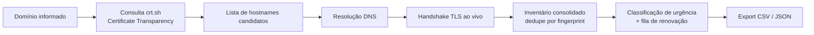

# Certificate Discovery Platform


Plataforma open source para descoberta e inventário de certificados TLS.

A aplicação recebe um domínio autorizado, consulta fontes públicas de
Certificate Transparency, identifica hosts relacionados, realiza resolução
DNS e handshake TLS e consolida os certificados encontrados em um inventário.

> **Nota:** este projeto foi desenvolvido com auxílio de IA (Claude), como
> peça de portfólio pessoal. O código foi revisado, mas pode conter bugs
> pontuais, casos de borda não cobertos ou comportamento inesperado em
> ambientes fora dos testados aqui. Use por sua conta e risco, revise antes
> de qualquer uso além de estudo/demonstração, e sinta-se à vontade para
> abrir uma issue se encontrar algo estranho.

<p align="center">
  
  
</p>

## Problema

Organizações frequentemente possuem certificados distribuídos entre
servidores, aplicações e provedores diferentes. Isso aumenta o risco de
certificados expirarem sem acompanhamento.

## Solução

A plataforma automatiza:

- descoberta de certificados públicos (via Certificate Transparency logs);
- identificação de hosts ativos;
- coleta de certificados via handshake TLS ao vivo;
- deduplicação por fingerprint SHA-256;
- classificação por urgência de expiração;
- montagem automática de uma fila priorizada de renovação;
- geração de inventário exportável (CSV/JSON).

## Como funciona



Importante: o crt.sh só devolve **metadados** (emissor, validade, SANs), não
os bytes do certificado. Por isso o inventário distingue dois tipos de
achado:

- **Confirmado ao vivo** (`live`): o handshake TLS teve sucesso, o
  certificado real foi capturado e tem fingerprint SHA-256 verificável — só
  esses entram nas classificações `expired`/`critical`/`warning`/`ok` e na
  fila de renovação.
- **Só CT log** (`ct_only`/`wildcard`/`unresolved`): hostname histórico sem
  confirmação ao vivo (por exemplo, um wildcard `*.sub.dominio.com`, ou um
  host que não resolveu DNS, ou que recusou o handshake). Aparece no
  inventário para visibilidade, mas não é tratado como certeza.

## ⚠️ Uso responsável

Use apenas em domínios que você possui ou está explicitamente autorizado a
testar. A ferramenta só consulta dados públicos (Certificate Transparency) e
realiza handshakes TLS padrão — o mesmo que qualquer navegador faz ao abrir
um site — mas ainda assim é um scanner, e como tal deve ser usado com
autorização e bom senso. O formulário exige uma confirmação explícita de
autorização antes de iniciar um scan.

## Instalação e execução

### Opção 1 — Docker (recomendada, mais simples)

Pré-requisito: [Docker](https://docs.docker.com/get-docker/) com Docker Compose.

```bash
git clone https://github.com/FJK-20/cert-discovery.git
cd cert-discovery
docker compose up --build
```

Abra `http://localhost:8000` no navegador. Pronto — nenhuma instalação de
Python, pip ou dependências no seu sistema. No primeiro acesso, a aplicação
pede para cadastrar o admin (veja [Acesso e autenticação](#acesso-e-autenticação)).

### Opção 2 — Python direto (sem Docker)

Pré-requisito: Python 3.13+ (para captura completa da cadeia de
certificados — em 3.12 ou anterior, a aplicação roda normalmente mas captura
só o certificado-folha, sem a cadeia).

```bash
git clone https://github.com/FJK-20/cert-discovery.git
cd cert-discovery
python3 -m venv .venv
source .venv/bin/activate   # Windows: .venv\Scripts\activate
pip install -r requirements.txt
uvicorn app.main:app --host 0.0.0.0 --port 8000 --workers 1
```

Abra `http://localhost:8000`.

## Acesso e autenticação

A aplicação exige uma conta de administrador com **MFA (TOTP) obrigatório**
— não existe modo "sem login" nem opção de pular o MFA.

1. **Primeiro acesso**: nenhum admin cadastrado ainda → tela de cadastro
   (usuário + senha, mínimo 8 caracteres).
2. **Configuração do MFA**: logo em seguida, um QR code é exibido para
   escanear com um app autenticador (Google Authenticator, Authy, 1Password,
   etc. — qualquer app compatível com TOTP/RFC 6238). O cadastro só é
   considerado concluído depois de confirmar um código válido de 6 dígitos;
   não há como pular essa etapa.
3. **Acessos seguintes**: login em duas etapas — usuário/senha e, depois,
   o código do autenticador. A sessão fica em um cookie `httpOnly`.
4. Toda a API de scan (`/api/scan/*`) exige sessão autenticada — sem login
   válido, retorna 401.

A conta (usuário, hash da senha, segredo TOTP) fica em `data/admin.json`
(permissão `0600`), persistida via volume Docker entre reinícios — só os
*jobs* de scan em si são efêmeros (ver [Limitações conhecidas](#limitações-conhecidas)).

**Perdeu acesso ao MFA?** Pare o serviço, apague `data/admin.json` e refaça
o cadastro. Não há fluxo de recuperação de conta na v1 (single-admin, MVP de
portfólio) — é um trade-off deliberado, não um recurso faltando por descuido.

## Variáveis de ambiente

| Variável                     | Padrão | Descrição                                            |
|-------------------------------|--------|-------------------------------------------------------|
| `CERTDISC_MAX_HOSTS`          | `400`  | Máximo de hosts investigados por scan                 |
| `CERTDISC_MAX_CONCURRENCY`    | `30`   | Handshakes TLS simultâneos                            |
| `CERTDISC_RATE_LIMIT_RPM`     | `6`    | Limite de scans por minuto, por IP do requisitante    |
| `CERTDISC_DATA_DIR`           | `data` | Diretório onde `admin.json` é persistido              |
| `CERTDISC_COOKIE_SECURE`      | `false`| Marca o cookie de sessão como `Secure` (ative atrás de HTTPS) |
| `CERTDISC_AUTH_RATE_LIMIT`    | `8`    | Limite de tentativas de login/MFA a cada 5 min, por IP |

## Segurança

Como a aplicação conecta a hosts derivados de um domínio informado pelo
usuário (via CT logs, que podem conter qualquer SAN histórico), ela inclui
proteção deliberada contra SSRF:

- validação do **IP já resolvido** (nunca do texto do hostname) antes de
  conectar, bloqueando redes privadas, loopback, link-local (incluindo o
  endpoint de metadata de nuvem `169.254.169.254`), CGNAT, multicast e
  variantes IPv6 (incluindo IPv4-mapped e NAT64, que podem esconder um IP
  privado dentro de um endereço IPv6);
- conexão sempre pelo **IP literal** resolvido uma única vez, nunca deixando
  a camada de socket/TLS re-resolver o hostname (evita DNS rebinding);
- rate limiting por IP do requisitante e checkbox de consentimento
  obrigatório no formulário.

Veja `app/core/security.py` e `tests/test_security.py` para a lista completa
de ranges bloqueados e os casos de teste.

Sobre a autenticação:

- senha com hash **scrypt** (`hashlib.scrypt` da stdlib, sem dependência
  extra), nunca armazenada em texto puro;
- **MFA (TOTP/RFC 6238)** implementado com a stdlib (`hmac`/`hashlib`),
  obrigatório desde o cadastro — não existe conta sem MFA configurado;
- login em duas etapas (senha, depois código) via tokens de curta duração
  em memória — a senha nunca autentica sozinha;
- rate limiting dedicado nas rotas de login/MFA (`CERTDISC_AUTH_RATE_LIMIT`),
  já que um código de 6 dígitos é força-bruteável sem esse limite;
- cookie de sessão `httpOnly` + `SameSite=Lax`; sem CORS liberado para
  outras origens (mitiga CSRF sem precisar de token dedicado).

## Limitações conhecidas

- **Jobs de scan são efêmeros**: vivem em memória de um único processo (por
  isso `--workers 1` é obrigatório). Reiniciar o serviço descarta scans em
  andamento — escolha deliberada de escopo, não uma limitação a corrigir. A
  conta de admin **não** é afetada por isso (fica persistida em disco).
- **Single-admin**: não é um sistema multiusuário — está fora do escopo
  deste MVP.
- **Dependência do crt.sh**: é um serviço público mantido por terceiros,
  conhecido por ser lento/instável sob carga. A aplicação já lida com isso
  (timeout, retry com backoff, detecção de resposta HTML de erro), mas se o
  serviço estiver fora do ar, use o campo "Avançado" da interface para colar
  subdomínios manualmente.
- **Wildcards** (`*.sub.dominio.com`) descobertos via CT log não são
  expandidos automaticamente — aparecem no inventário sinalizados como tal.

## Testes

```bash
pip install -r requirements-dev.txt
pytest
ruff check .
```

Todos os testes são offline/determinísticos: consultas ao crt.sh são
mockadas (`httpx.MockTransport`), e o handshake TLS é testado contra um
servidor local com certificado self-signed gerado no próprio teste — nenhum
teste depende de rede externa.

## Roadmap / ideias futuras

- Expansão opcional de wildcards por labels comuns.
- Suporte a outras fontes de CT log além do crt.sh (redundância).
- Histórico de scans (com persistência opcional).
- Notificação (e-mail/webhook) quando um certificado entra na fila crítica.

## Licença

MIT — veja [LICENSE](LICENSE).
